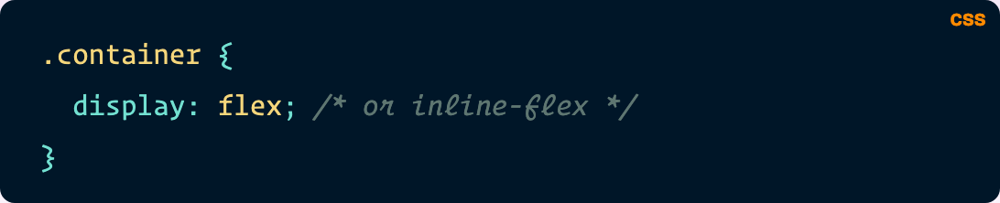
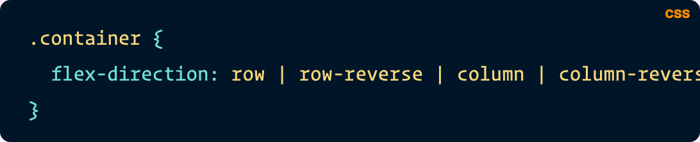
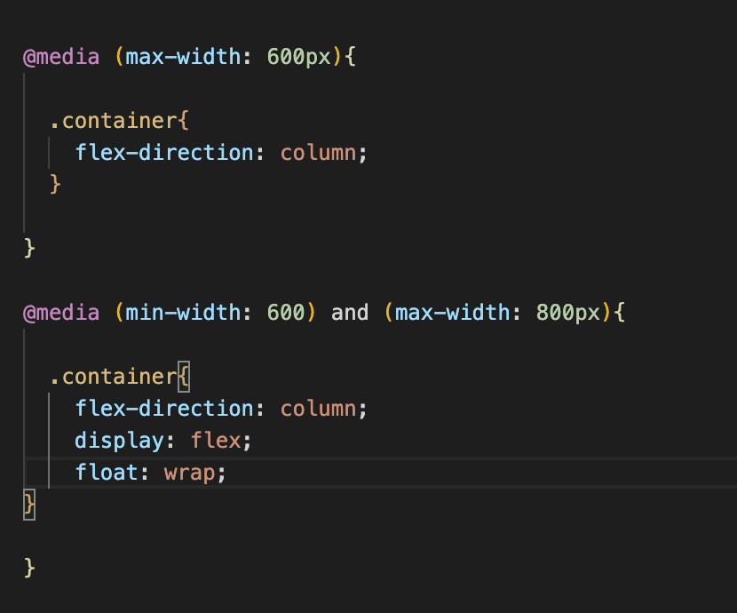
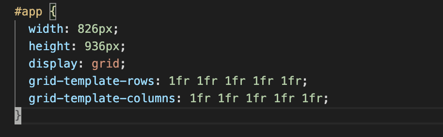
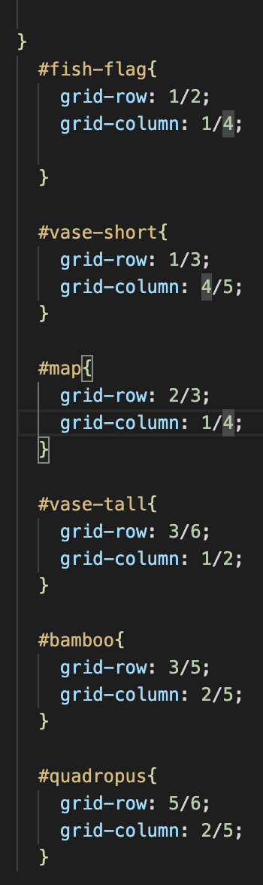

# What I Learned Week 13

## Flex Box

Flex Box is a layout module used to organize the skeleton of a webpage. To initiate flex box, type display: flex; in you parent container in CSS

From here you can use various various other attributes to alighn your content.

## Media Queries

We learned how to dynamically adjust a page to mobile view or tablet. To do this, one must add:

## Grid

Grid is an awesome and super easy way to layout a webpage. Simply layout your dimensions and start labeling your grid

#Emmet

[Emmet Cheat Sheet](https://docs.emmet.io/cheat-sheet/)